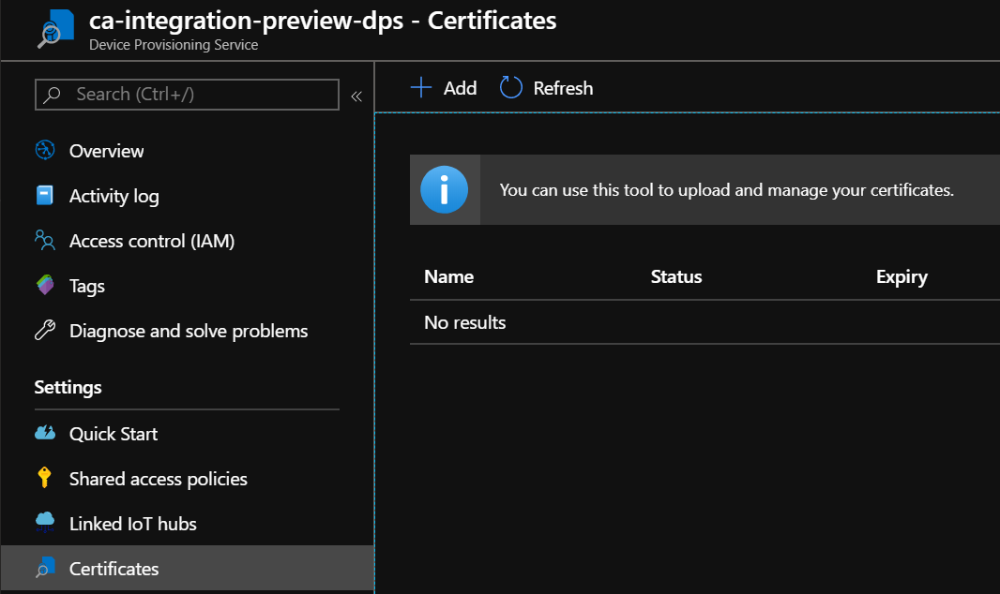
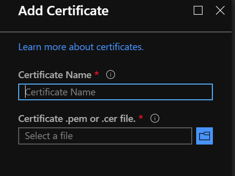
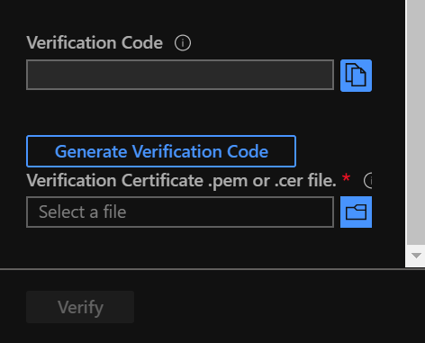
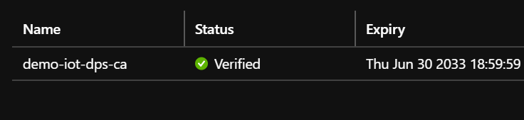
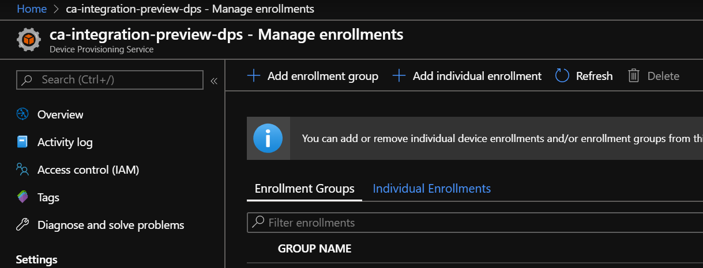
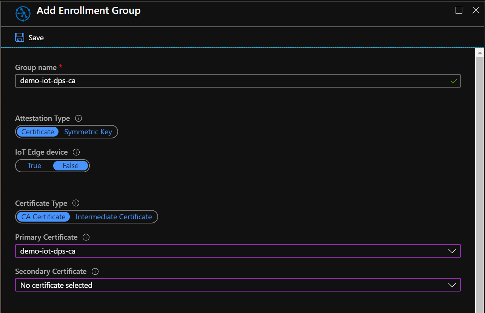

# Setting up IoT Hub Device Provisioning Service with a CA Certificate

This readme walks you through creating a Certificate Authority, generating device x509 certificates, and registring devices with IoT Hub using Azure IoT Device Provisioning Service (DPS) group enrollment.

All commands specified were tested on Ubuntu 18.04 running in WSL2.  This readme assumes an instance of IoT Hub has already been created and linked with DPS.

## 1. Generate your CA Private Key

Though in the real world we may want to rely on an actual Certificate Authority to sign your certificates, for purposes of this demo we'll generate a CA private key and act as the CA.

Generate an RSA private key for your CA as follows:

`openssl genrsa -des3 -out server.CA.key 2048`

## 3. Generate your CA Certificate Signing Request (CSR)

The next step is to provide a Certificate Signing Request to the CA.  This request contains all the desired information we want to be on the certificate including company, country, common name, etc.  Here we'll also include CA key so OpenSSL can add the public key as part of the certificate request.  We're creating a CA here, so we'll be self-signing.

`openssl req -verbose -new -key server.CA.key -out server.CA.csr -sha256`

I've chosen the following data for my CSR:

```
Country Name (2 letter code) [AU]:US
State or Province Name (full name) [Some-State]:CO
Locality Name (eg, city) []:Denver
Organization Name (eg, company) [Internet Widgits Pty Ltd]:Microsoft Demos
Organizational Unit Name (eg, section) []:IoT
Common Name (e.g. server FQDN or YOUR name) []:devices.demos.microsoft
Email Address []:
```

## 4. Prep your demo CA folder

There are a few files expected by openSSL to exist so it can track what certificates have been issued as well as a serial number for each.  To prep this directory to be a demo CA run the following commands:

```
mkdir -p ./demoCA/newcerts;
touch ./demoCA/index.txt;
touch ./demoCA/index.txt.attr;
echo 1000 > ./demoCA/serial;
```

## 4. Sign the CSR

We'll now sign the Certificate Signing Request, generating the final self-signed CA certificate.

`openssl ca -extensions v3_ca -out server.CA-signed.cer -keyfile server.CA.key -verbose -selfsign -md sha256 -enddate 330630235959Z -infiles server.CA.csr`


## 5. Upload the CA certificate to DPS

From the Azure Portal, choose certificates inside the Device Provisioning Service blade then click Add:



Pick a name for your certificate (this can be any name and does not refer to the certificate CN) and select the .pem file that was generated in ./demoCA/newcerts/




## 6. Verify CA Certificate Ownership

Before you can provision devices, DPS requires that you prove you have the ability to sign a certficiate.  DPS will provide a randomly generated code that you must use as the Common Name (CN) in an x509 certificate.

To get this code, click "generate verification code" in the portal



Now, generate a verification key:

`openssl genrsa -out verification.key 2048`

Next, generate a new verification CSR.  Ensure the Common Name (CN) is the verification code provided in the Azure portal.

`openssl req -new -key verification.key -out verification.csr`

```
Country Name (2 letter code) [AU]:US
State or Province Name (full name) [Some-State]:Colorado
Locality Name (eg, city) []:Denver
Organization Name (eg, company) [Internet Widgits Pty Ltd]:Microsoft Demos
Organizational Unit Name (eg, section) []:IoT
Common Name (e.g. server FQDN or YOUR name) []:6FDE7E17699E89D0F41DBCAE062A496A060DB6FDC9B8CB5A
Email Address []:
```

Now sign the CSR to create our proof-of-posession certificate:

`openssl x509 -req -in verification.csr -CA server.CA-signed.cer -CAkey server.CA.key -CAcreateserial -out verification.pem -days 1024 -sha256`

Upload verification.pem to the Azure Portal.


Confirm the certificate shows as verified.



## 7. Create a CSR for your Device

```
openssl req \
    -newkey rsa:2048 \
    -nodes \
    -keyout device.key \
    -out device.csr;
```

The Common Name (CN) provided here will be the *Registration ID* you want to use for DPS.  In this case I'm just using a sample name:

```
Country Name (2 letter code) [AU]:US
State or Province Name (full name) [Some-State]:Colorado
Locality Name (eg, city) []:Denver
Organization Name (eg, company) [Internet Widgits Pty Ltd]:Microsoft Demos
Organizational Unit Name (eg, section) []:IoT
Common Name (e.g. server FQDN or YOUR name) []:iothubx509device1
Email Address []:
```

## 8. Sign the Device Certificate

```
openssl x509 \
    -req \
    -sha256 \
    -CA server.CA-signed.cer \
    -CAkey server.CA.key \
    -days 730 \
    -in device.csr \
    -out device.pem;
```

## 9. Create a PFX Certificate Bundle
The Device SDK needs both the Signed Certificate as well as the private key information.  It expects to load a single PFX-formatted Bundle containing all necessarily information.

We can combine the Key and Certificate to a PFX archive as follows:

```
openssl pkcs12 -export -out device.pfx -inkey device.key -in device.cer
```

## Create an enrollment group

Add a new enrollment group.



Select the CA certificate


## Run the Sample application
Edit program.cs in `src/dpsx509ca` to include your DPS ID Scope, then call `dotnet run` to provision the sample application as a device against your Enrollment Group with a Device ID of the Common Name (CN) in the certificate.